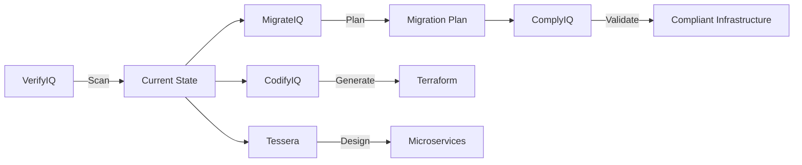

# Tools Overview

InfraIQ provides seven integrated tools that work together or standalone.

## The Suite

| Tool | Purpose | Status |
|------|---------|--------|
| [MigrateIQ](migrateiq) | Cloud-to-cloud migration | Production Ready |
| [VerifyIQ](verifyiq) | Security & compliance scanning | Production Ready |
| [CodifyIQ](codifyiq) | Infrastructure as Code generation | Production Ready |
| [ComplyIQ](complyiq) | Compliance automation | Production Ready |
| [DataIQ](dataiq) | Database migration | Enterprise Ready |
| [SecureIQ](secureiq) | Secret management | Production Ready |
| [Tessera](tessera) | Monolith decomposition | Production Ready |

## How They Work Together



### Shared Components

When used together, the tools share:

- **Infrastructure Knowledge Graph** — Single source of truth
- **Shared Scanning Engine** — Reuse discovery across tools
- **Unified CLI** — Consistent command structure
- **Combined Reporting** — Complete visibility
- **Cross-Tool Validation** — Each tool validates the others

## Quick Reference

### MigrateIQ

```bash
# Scan source infrastructure
infraiq migrate scan heroku --app-name my-app

# Map to target provider
infraiq migrate map scan.json aws

# Generate Terraform
infraiq migrate generate migration-plan.json --output ./terraform
```

### VerifyIQ

```bash
# Security scan
infraiq verify scan --provider aws --output report.json

# Analyze report
infraiq verify analyze report.json

# Validate Terraform
infraiq verify validate ./terraform
```

### CodifyIQ

```bash
# Discover resources
infraiq codify scan aws --region us-east-1 -o scan.json

# Generate Terraform
infraiq codify generate scan.json --output ./terraform
```

### ComplyIQ

```bash
# Quick compliance check
infraiq complyiq quickscan

# Full SOC2 evidence collection
infraiq complyiq scan --provider aws --framework soc2 --bucket evidence-bucket
```

### DataIQ

```bash
# Discover database structure
infraiq dataiq discover --source postgresql://... --output discovery.json

# Plan migration
infraiq dataiq plan --assessment discovery.json --target aurora-postgresql

# Execute with self-healing
infraiq dataiq migrate --plan migration-plan.json --self-heal --auto-cutover
```

### SecureIQ

```bash
# Discover secrets
infraiq secureiq scan --provider heroku --input scan.json --output secrets.yaml

# Audit for compliance
infraiq secureiq audit --manifest secrets.yaml --framework soc2
```

### Tessera

```bash
# Analyze monolith
infraiq tessera analyze --source . --output analysis.json

# Design microservices
infraiq tessera design --analysis analysis.json --pattern hybrid --output mosaic.yaml

# Generate service scaffolds
infraiq tessera craft --mosaic mosaic.yaml --framework fastapi --output ./services
```

## When to Use Each Tool

| Scenario | Tool |
|----------|------|
| Migrating from Heroku to AWS | MigrateIQ |
| Security audit before migration | VerifyIQ |
| Converting ClickOps to GitOps | CodifyIQ |
| Preparing for SOC2 audit | ComplyIQ |
| Upgrading PostgreSQL version | DataIQ |
| Mapping secrets before migration | SecureIQ |
| Breaking up a monolith | Tessera |
| Complete modernization | All of them! |

## Next Steps

- [MigrateIQ](migrateiq) — Deep dive into migrations
- [Quick Start](/docs/getting-started/quickstart) — Your first migration
- [Heroku to AWS Guide](/docs/guides/heroku-to-aws) — Complete walkthrough
